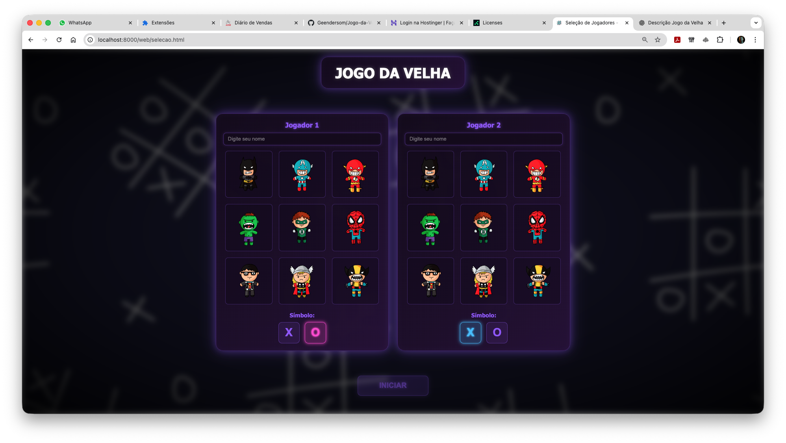
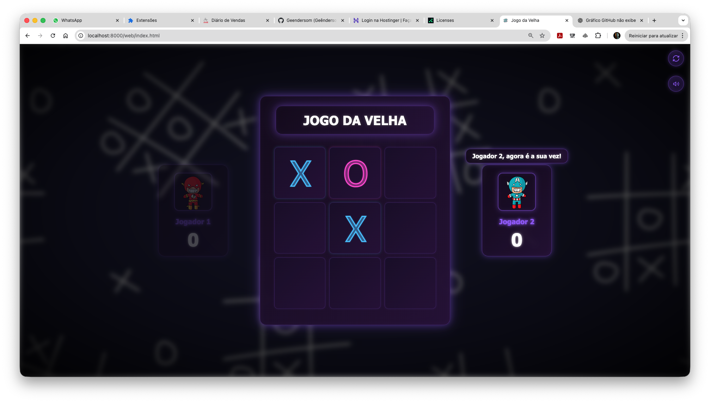
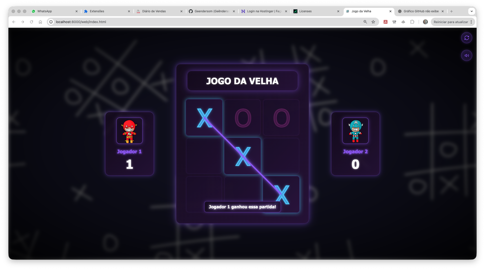

# 🎮 Jogo da Velha - Python no Navegador

Jogo da Velha desenvolvido em **Python puro**, executado diretamente no navegador usando Pyodide.

## 🖼️ Pré-visualização

<p align="center">
  
</p>

<p align="center">
  
</p>

<p align="center">
  
</p>

## 📋 Descrição

Este projeto demonstra como executar código Python diretamente no navegador, mantendo Python como a linguagem principal. Toda a lógica do jogo, manipulação do DOM e controle de eventos são escritos em Python.

## 🏗️ Estrutura do Projeto

```
jogo-da-velha/
├── web/                    # Arquivos web (HTML, CSS, JS)
│   ├── index.html          # Interface principal do jogo
│   ├── selecao.html        # Tela de seleção de jogadores
│   ├── styles.css          # Estilos CSS do jogo
│   └── mensagens.js       # JavaScript auxiliar para mensagens
├── python/                 # Código Python
│   └── JogoDaVelha.py     # Lógica principal do jogo em Python
├── server/                 # Servidor HTTP
│   └── server.py           # Servidor Python simples
├── docs/                   # Documentação
│   └── COMO_EXECUTAR.txt  # Instruções de execução
├── assets/                 # Recursos do jogo
│   ├── print1.png         # Preview 1 do jogo
│   ├── print2.png         # Preview 2 do jogo
│   └── *.png              # Avatares dos jogadores
├── favicon.png            # Ícone do jogo
├── wallpaper.jpg          # Imagem de fundo
├── ESTRUTURA.md           # Documentação da estrutura
└── README.md              # Este arquivo
```

## 🚀 Como Executar

### Pré-requisitos
- Python 3.6 ou superior
- Navegador moderno (Chrome, Firefox, Safari, Edge)

### Instruções

1. **Abra o terminal na pasta do projeto:**
   ```bash
   cd /Users/geendersomaraujo/Desktop/jogo-da-velha
   ```

2. **Execute o servidor:**
   ```bash
   python3 server/server.py
   ```

3. **O navegador abrirá automaticamente.** Se não abrir, acesse:
   ```
   http://localhost:8000/web/index.html
   ```

4. **Para parar o servidor**, pressione `Ctrl+C` no terminal

⚠️ **IMPORTANTE:** Não abra o arquivo HTML diretamente. O Pyodide requer que os arquivos sejam servidos via HTTP.

## 🎯 Características

- ✅ **100% Python** - Toda a lógica escrita em Python
- ✅ **Execução no Navegador** - Usa Pyodide (Python compilado para WebAssembly)
- ✅ **Manipulação do DOM em Python** - Acessa e modifica elementos HTML diretamente do Python
- ✅ **Event Listeners em Python** - Configura eventos do navegador usando Python
- ✅ **Interface Moderna** - Design responsivo e bonito

## 🐍 Tecnologias

- **Python 3** - Linguagem principal
- **Pyodide** - Python para WebAssembly
- **HTML5/CSS3** - Interface web
- **JavaScript** - Apenas para inicializar o Pyodide (mínimo necessário)

## 📝 Desenvolvido por

**Geêndersom Araújo**

## 📄 Licença

Este projeto é de código aberto e está disponível para uso educacional.

---

**Divirta-se jogando! 🎉**
